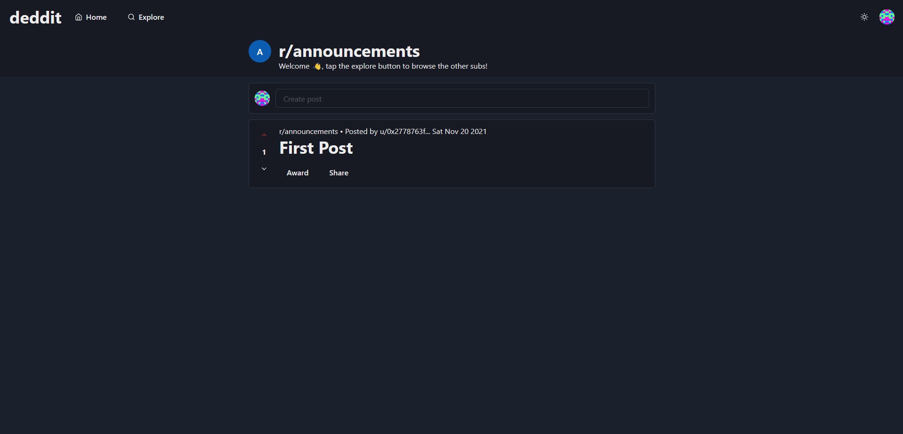

# Info

Deddit is a decentralized version of the popular social media platform, Reddit. It allows users to create posts, communities and upvote and downvote posts and comments. Also features awarding, where you can award users in cUSD.
It is built with Next.js, react and chakra-ui.

Feel free to submit any suggestions or improvements!



# Live Demo

[Demo](https://celo-reddit.vercel.app/)

# Install

```
npm install
```

# Start

```
npm run dev
```

# Build

```
npm run build
```
# Usage
1. Install the [CeloExtensionWallet](https://chrome.google.com/webstore/detail/celoextensionwallet/kkilomkmpmkbdnfelcpgckmpcaemjcdh?hl=en) from the google chrome store.
2. Create a wallet.
3. Go to [https://celo.org/developers/faucet](https://celo.org/developers/faucet) and get tokens for the alfajores testnet.
4. Switch to the alfajores testnet in the CeloExtensionWallet.